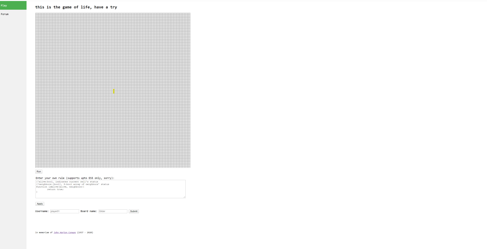
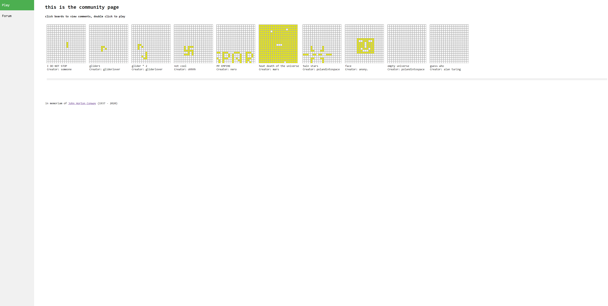

# Game of Life

## Overview

An interactive implementation of [Conway's Game of Life](https://en.wikipedia.org/wiki/Conway's_Game_of_Life), a cellular automation game, that allows
- customized (programmable!) rules
- customized board setup, in-game modification
- users to share their own game with the community and make comments
- more features to be added...


## Data Model

NOTE: This has changed greatly over the course of development

The application will store User, Board and Comment

* User can have multiple Board (via references)
* each Board can have multiple Comment (via references)

An Example User:

```javascript
{
  uid: "nv982jc9304" //some hash
  username: "gliderlover",
  hash: // a password hash,
  lists: [glider, gun, myspaceship1]// an array of references to Board documents
}
```

An Example Board:

```javascript
{
  user: gliderlover// a reference to a User object
  name: "Breakfast foods", //default to empty string
  board: //a large enough 2d-matrix of bool values, representing the game board
  createdAt: // timestamp
}
```

An example Comment

```javascript
{
  user: gliderlover // a reference to a User object
  title: "", //default to empty string
  comment: "nice work with the spaceship!" //plain-text
  createdAt: // timestamp
  quote: // a reference to the quote
}
```


## [Link to Commented Schema](db.js)

## Wireframes

/ - homepage for playing your own game


/community - page for community games


## Snapshots

/ - homepage for playing your own game



/community - page for community games



## Site map
There are two sites:

http://linserv1.cims.nyu.edu:27334/ <-> http://linserv1.cims.nyu.edu:27334/community

## User Stories or Use Cases

1. as a user, I can play with my customized game
2. as a user, I can write customized game rules
3. as a user, I can choose to share my game with the community
3. as a user, I can view, play, and comment on community games

## Research Topics

* (3 points) HTML Canvas with Client Side JavaScript
* (5 points) Google Caja - API for user code validation/sanitization/evaluation

8 points total out of 8 required points


## [Link to Entry Point](app.js)

## Annotations / References Used

1. Inspiration: https://bitstorm.org/gameoflife/;
2. w3school demo: https://www.w3schools.com/graphics/tryit.asp?filename=trygame_default_gravity, https://www.w3schools.com/howto/howto_css_sidebar_responsive.asp
3. Google Caja: https://developers.google.com/caja/docs/runningjavascript, https://google.github.io/caja/docs/cajajs/
