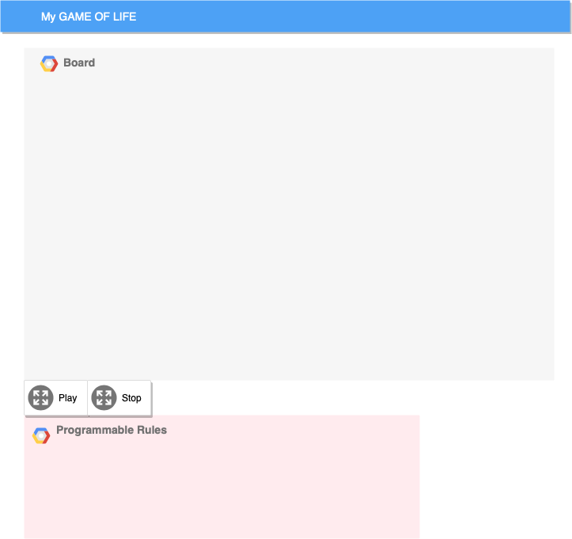
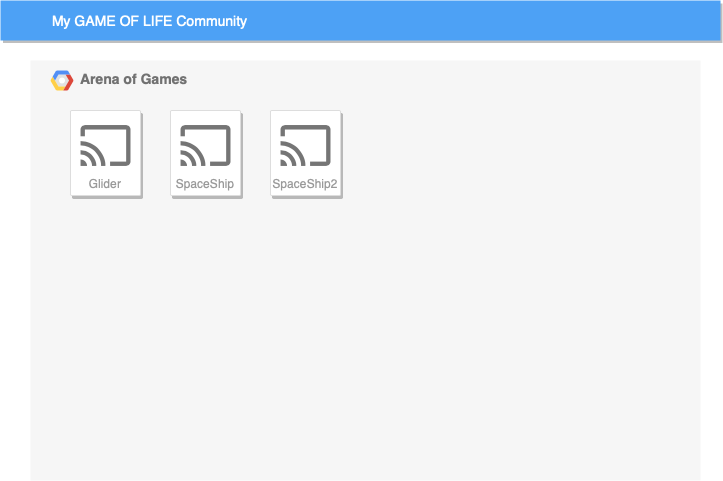

# Game of Life

## Overview

An interactive implementation of [Conway's Game of Life](https://en.wikipedia.org/wiki/Conway's_Game_of_Life), a cellular automation game, that allows
- customized (programmable?) rules
- customized board setup, in-game modification
- users to share their own game config with the community and make comments
- more features to be added...


## Data Model

The application will store User, Board and Comment

* User can have multiple Board (via references)
* each Board can have multiple Comment (via references)

An Example User:

```javascript
{
  uid: "nv982jc9304" //some hash
  username: "gliderlover",
  hash: // a password hash,
  lists: [glider, gun, myspaceship1]// an array of references to Board documents
}
```

An Example Board:

```javascript
{
  user: gliderlover// a reference to a User object
  name: "Breakfast foods", //default to empty string
  board: //a large enough 2d-matrix of bool values, representing the game board
  createdAt: // timestamp
}
```

An example Comment

```javascript
{
  user: gliderlover // a reference to a User object
  title: "", //default to empty string
  comment: "nice work with the spaceship!" //plain-text
  createdAt: // timestamp
  quote: // a reference to the quote
}
```


## [Link to Commented First Draft Schema](db.js)

## Wireframes

/ - homepage for playing your own game



/community - page for community games



## Site map
There are two sites:

www.gameoflife2020.com/ <-> www.gameoflife2020.com/community

## User Stories or Use Cases

1. as a user, I can play with my customized game
2. as a user, I can write customized game rules
3. as a user, I can choose to share my game with the community
3. as a user, I can view, play, and comment on community games

## Research Topics

* (3 points) Unit Testing with Mocha
* (4 points) Perform client side form validation using a JavaScript library
* (4 points) React
    * used React as the frontend framework

11 points total out of 8 required points


## [Link to Initial Main Project File](app.js)

## Annotations / References Used

1. [tutorial on using Mocha for unit testing](https://mochajs.org/#getting-started) - (source code not added yet)
2. [tutorial on react](https://reactjs.org/tutorial/tutorial.html) - (source code not added yet)
